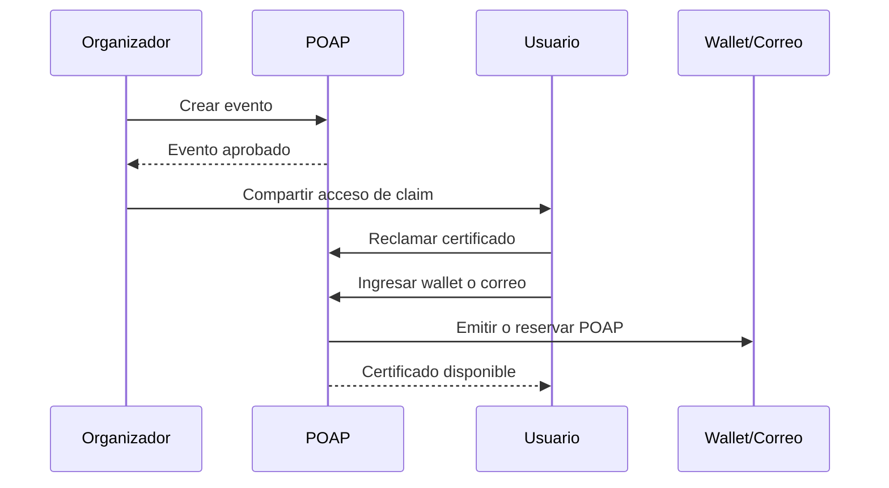
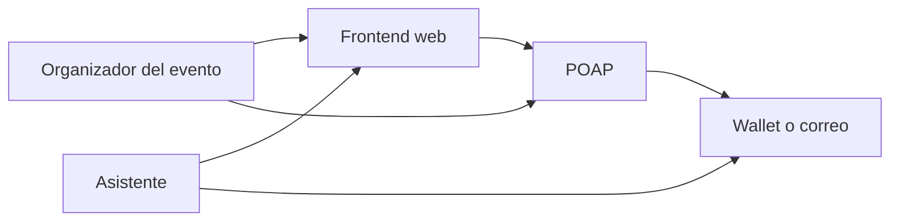
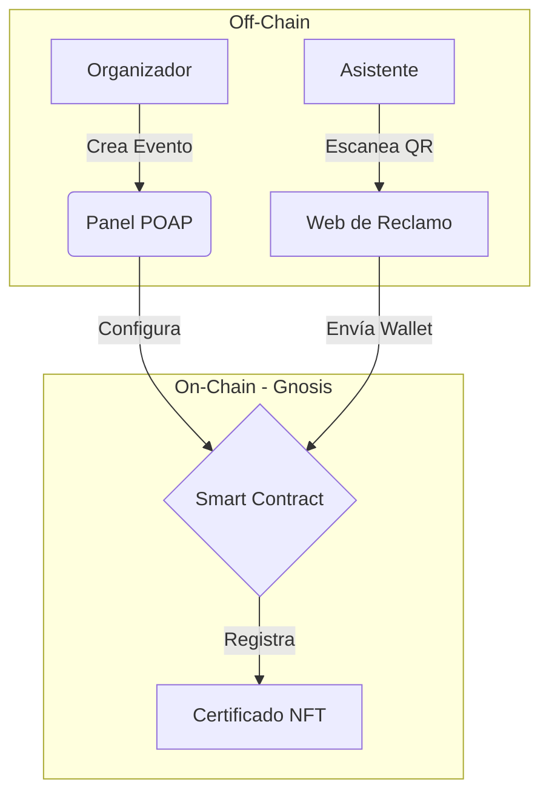
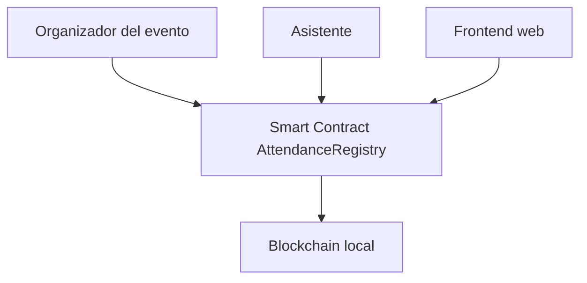

# blockchain-event-certificates

Proyecto de certificados de asistencia a eventos inspirado en POAP, implementado con smart contracts propios en Solidity.

## Descripción del sistema

Este proyecto propone una solución mínima para la emisión de certificados de asistencia a eventos utilizando POAP (Proof of Attendance Protocol). El objetivo es representar la asistencia de una persona a un evento académico, charla, taller, webinar o conferencia mediante un certificado digital verificable.

En lugar de desarrollar un contrato inteligente propio, la solución reutiliza la infraestructura de POAP como protocolo especializado en certificados de asistencia. De esta forma, se reduce la complejidad técnica del prototipo y se enfoca el proyecto en el análisis de arquitectura, el flujo de transacciones y la interacción entre componentes.

El sistema está diseñado para que un organizador cree un evento, habilite un método de distribución del certificado y permita que los asistentes reclamen su comprobante digital al finalizar o durante la actividad.

## Arquitectura

La arquitectura mínima del sistema está compuesta por los siguientes elementos:

1. **Organizador del evento**  
   Responsable de crear el evento y configurar la distribución del certificado de asistencia.

2. **Frontend web**  
   Interfaz simple donde el asistente visualiza información del evento y accede al proceso de reclamo del certificado.

3. **POAP**  
   Protocolo que gestiona la creación del evento, la distribución del claim y la emisión del certificado digital.

4. **Asistente**  
   Usuario que participó en el evento y desea reclamar su certificado.

5. **Wallet o email**  
   Medio por el cual el asistente recibe o reserva el certificado.

## Flujo de transacciones

1. El organizador crea el evento de certificados de asistencia en POAP.
2. POAP revisa y aprueba el evento.
3. El organizador recibe el mecanismo de distribución del claim.
4. El asistente accede al enlace o flujo de reclamo desde la interfaz web.
5. El asistente ingresa su wallet o correo electrónico.
6. POAP emite o reserva el certificado digital de asistencia.
7. El asistente conserva el POAP como evidencia de participación en el evento.

## Diagrama de componentes

### Diagrama de Componentes Detallado

### Justificación de la Tecnología (Análisis de Capas)
Para una eficiente funcionalidad, se divide en tres capas técnicas:
* **Capa de Aplicación:** El asistente usa una interfaz web simple para reclamar su certificado sin necesidad de saber programar.
* **Capa de Red (Gnosis Chain):** Los certificados se emiten en esta red (una "sidechain" de Ethereum) por las facildiades que provee, permitiendo que el trámite sea gratuito.
* **Capa de Activos (NFT):** Cada certificado es un token **ERC-721**. Esto garantiza que cada asistencia sea única, no se pueda duplicar y sea propiedad total del que asiste al evento.

### Propiedades de Seguridad y Confianza
1. **Inmutabilidad:** Una vez emitido el POAP, nadie puede borrar el registro de que asististe al evento.
2. **Verificabilidad:** Cualquier empresa puede revisar tu wallet en un explorador de bloques (como GnosisScan) para confirmar que tu certificado es real.
3. **Prevención de Fraude:** Al usar enlaces únicos, se evita que personas que no estuvieron en la charla, evento, etc, obtengan el título.

## Desarrollo de contratos inteligentes

Para la segunda entrega del proyecto se implementó un smart contract propio en Solidity utilizando Hardhat y una blockchain local. En lugar de depender directamente de la infraestructura de POAP, se desarrolló una versión simplificada del concepto de prueba de asistencia.

El contrato principal del sistema es `AttendanceRegistry.sol`, el cual permite:

- crear eventos
- registrar asistencia de direcciones
- verificar asistencia por evento
- cerrar eventos

Esta implementación mantiene coherencia con el proyecto original de certificados de asistencia a eventos y prepara la base para la futura Dapp y el despliegue en Polygon Amoy.  [oai_citation:1‡13_proyectosFinales.pdf](sediment://file_00000000957c71fdbb35c7df36dde4f0)

## Desarrollo de contratos inteligentes

Para la segunda entrega del proyecto se implementó un smart contract propio en Solidity utilizando Hardhat y una blockchain local. En lugar de depender directamente de la infraestructura de POAP, se desarrolló una versión simplificada del concepto de prueba de asistencia.

El contrato principal del sistema es `AttendanceRegistry.sol`, el cual permite:

- crear eventos
- registrar asistencia de direcciones
- verificar asistencia por evento
- cerrar eventos

Esta implementación mantiene coherencia con el proyecto original de certificados de asistencia a eventos y prepara la base para la futura Dapp y el despliegue en Polygon Amoy.  [oai_citation:1‡13_proyectosFinales.pdf](sediment://file_00000000957c71fdbb35c7df36dde4f0)

## Evidencia local

- Compilación exitosa con Hardhat
- 4 pruebas unitarias aprobadas
- Despliegue local del contrato en blockchain local
- Dirección del contrato desplegado: `0x5FbDB2315678afecb367f032d93F642f64180aa3`

# blockchain-event-certificates

Proyecto de certificados de asistencia a eventos inspirado en POAP, implementado con smart contracts propios en Solidity.

## Descripción del sistema

Este proyecto propone una solución mínima para registrar asistencia a eventos académicos, charlas, talleres, webinars o conferencias mediante blockchain. La idea general toma como referencia el concepto de prueba de asistencia popularizado por POAP, pero la implementación desarrollada en este repositorio utiliza un smart contract propio en lugar de depender directamente de contratos externos.

El objetivo del sistema es permitir que un organizador cree un evento, registre la asistencia de participantes y pueda verificar posteriormente si una dirección específica asistió o no a una actividad determinada. De esta forma, se construye una base funcional simple, coherente con el alcance del curso y preparada para evolucionar hacia una Dapp y un despliegue en Polygon Amoy.

En esta etapa, la solución se concentra en el desarrollo, prueba y despliegue local de contratos inteligentes utilizando Solidity, Hardhat y una blockchain local. La interfaz web incluida en el repositorio representa una base preliminar del proyecto, pero la interacción directa con wallet y smart contracts corresponde a la siguiente entrega.

## Arquitectura

La arquitectura mínima del sistema está compuesta por los siguientes elementos:

1. **Organizador del evento**  
   Responsable de crear eventos y registrar la asistencia de los participantes.

2. **Smart contract `AttendanceRegistry`**  
   Contrato principal del sistema. Gestiona la creación de eventos, el registro de asistencia y la verificación de participación.

3. **Blockchain local**  
   Entorno de ejecución utilizado para compilar, probar y desplegar el contrato durante la segunda entrega.

4. **Asistente**  
   Persona participante cuya dirección puede ser registrada como asistente de un evento.

5. **Frontend web**  
   Componente preliminar del proyecto que servirá como base para la futura Dapp. En esta entrega todavía no interactúa directamente con el contrato.

## Flujo de transacciones

El flujo básico del sistema es el siguiente:

1. El organizador despliega el smart contract en una blockchain local.
2. El organizador crea un evento dentro del contrato mediante su nombre.
3. El organizador registra la asistencia de una dirección para un evento específico.
4. El contrato almacena esa asistencia on-chain.
5. Posteriormente, cualquier usuario puede consultar si una dirección asistió a un evento.
6. El organizador puede cerrar el evento para impedir nuevos registros.

## Diagrama de componentes

## Diagrama de flujo de transacciones

sequenceDiagram
    participant O as Organizador
    participant C as AttendanceRegistry
    participant B as Blockchain local
    participant U as Usuario

    O->>C: Desplegar contrato
    O->>C: Crear evento
    O->>C: Registrar asistencia
    C->>B: Guardar asistencia on-chain
    U->>C: Consultar asistencia
    C-->>U: Retornar verdadero/falso
    O->>C: Cerrar evento

## Desarrollo de contratos inteligentes

Para la segunda entrega se implementó el contrato inteligente `AttendanceRegistry.sol`, desarrollado en Solidity y probado con Hardhat sobre blockchain local.

El contrato permite:

- crear eventos
- registrar asistencia de direcciones
- verificar asistencia por evento
- cerrar eventos

Este enfoque mantiene la coherencia con el proyecto original de certificados de asistencia, pero adapta la solución al objetivo académico del curso: desarrollar contratos propios y prepararlos para una futura integración con una Dapp.

## Estructura del proyecto

- `contracts/AttendanceRegistry.sol`: contrato principal del sistema
- `scripts/deploy.js`: script de despliegue local
- `test/AttendanceRegistry.test.ts`: pruebas unitarias del contrato
- `hardhat.config.ts`: configuración de Hardhat
- `web/index.html`: base preliminar para la futura interfaz web

## Evidencia local

- Compilación exitosa con Hardhat
- 4 pruebas unitarias aprobadas
- Despliegue local del contrato realizado correctamente
- Dirección desplegada localmente: `0x5FbDB2315678afecb367f032d93F642f64180aa3`

## Manual para pruebas locales

### 1. Clonar el repositorio

### 2. Instalar dependencias

npm install

### 3. Compilar el smart contract

npx hardhat compile

### 4. Ejecutar las pruebas unitarias

npx hardhat test

### 5. Levantar una blockchain local

npx hardhat node --port 8546

### 6. Desplegar el contrato en la blockchain local

npx hardhat run scripts/deploy.js --network localhost8546

## Justificación técnica

Se decidió implementar un contrato propio simplificado en lugar de depender directamente de POAP, porque esto permite practicar de forma explícita los contenidos del curso relacionados con Solidity, Hardhat y despliegue en entornos EVM compatibles.

El modelo implementado no busca replicar toda la complejidad de POAP, sino capturar su idea central de prueba de asistencia en una versión mínima, comprensible y extensible. Esta decisión también facilita la continuidad del proyecto hacia las siguientes entregas: primero el desarrollo de la Dapp y después el despliegue final en Polygon Amoy.

## Alcance actual

En esta fase el proyecto incluye:

- arquitectura base del sistema
- smart contract funcional
- pruebas unitarias
- despliegue local
- estructura preparada para futuras entregas

Queda fuera del alcance de esta entrega:

- integración completa con Metamask
- despliegue en Polygon Amoy
- emisión de NFTs completos tipo ERC-721
- integración directa con infraestructura real de POAP

## Próximos pasos

Para las siguientes entregas, el proyecto evolucionará en esta dirección:

1. Crear una interfaz web que permita interactuar con el contrato usando wallet.
2. Conectar esa interfaz al smart contract desplegado.
3. Desplegar la solución en Polygon Amoy.
4. Presentar el sistema completo como una versión simplificada de certificados de asistencia en blockchain.

## Autoría

Proyecto desarrollado por Pedro Soto y Sofia Oviedo como parte del curso Blockchain and Distributed Ledgers.
